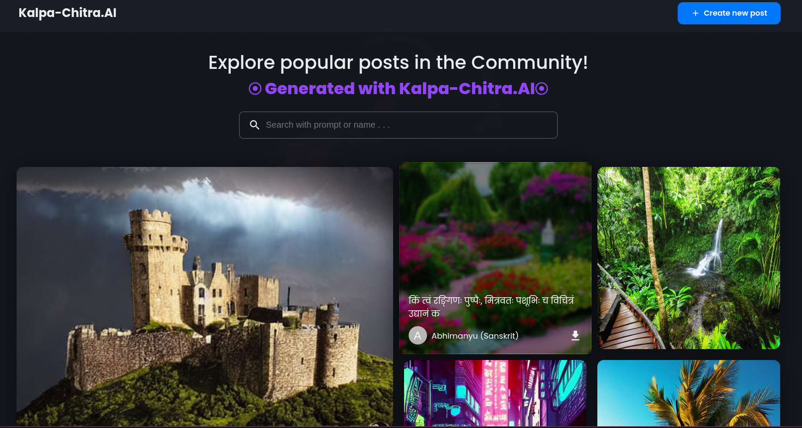
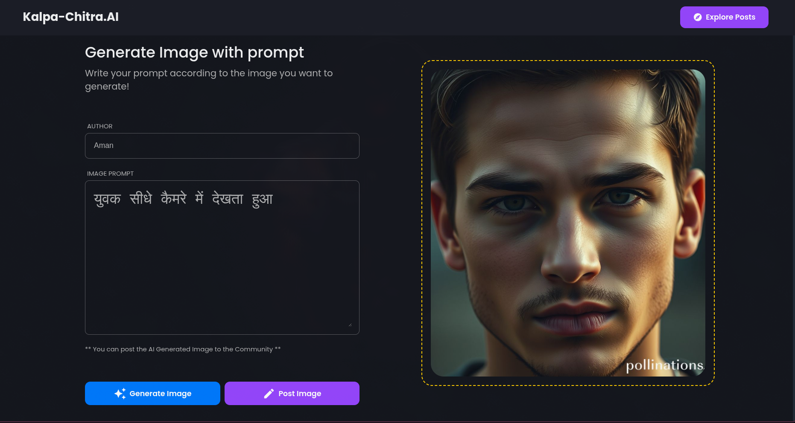

# KalpaChitra.AI - AI Image Generator & Community Showcase


KalpaChitra.AI is a full-stack MERN application that brings your imagination to life. It leverages the power of Pollinations AI to generate unique, high-quality images from simple text descriptions. Users can create new art, share it with a vibrant community, and browse a gallery of creations for inspiration.

### **Live Demo**

**➡️ [View the live application here](https://kalpa-chitra.netlify.app/)**

---

### Key Features

- **🤖 AI-Powered Image Generation**: Integrates directly with the Pollinations AI to turn text prompts into visual art.
- **🖼️ Community Gallery**: A responsive, grid-based showcase of all user-shared images.
- **🌍 Multilingual Prompts**: The AI understands and generates images from prompts written in various languages, not just English.
- **🔍 Prompt Discovery**: Hover over any image in the gallery to see the exact prompt used to create it.
- **🔎 Search Functionality**: Easily search the gallery to find images based on prompt keywords.
- **📱 Responsive Design**: A seamless experience across desktop, tablet, and mobile devices.
- **🚀 Automated CI/CD**: Includes a `Jenkinsfile` and `Dockerfile` for automated building and containerization.

---

### Screenshots

| Home Page - Community Showcase                           | Create Post Page                                               |
| -------------------------------------------------------- | -------------------------------------------------------------- |
|  |  |
| _A vibrant, public gallery of AI-generated images._      | _An intuitive interface to generate and share your creations._ |

---

### Technology Stack

- **Frontend**: React, styled-components
- **Backend**: Node.js, Express.js
- **Database**: MongoDB with Mongoose
- **AI Service**: Pollinations AI
- **Image Hosting**: Cloudinary
- **CI/CD**: Jenkins, Docker

---

### Getting Started

To get a local copy up and running, follow these simple steps.

#### Prerequisites

- Node.js and npm
- MongoDB instance (local or cloud-based)
- Git
- Cloudinary

#### Installation & Setup

1.  **Clone the repository:**

    ```sh
    git clone https://github.com/your-username/kalpachitra.ai.git
    cd kalpachitra.ai
    ```

2.  **Setup the Backend:**

    - Navigate to the server directory:
      ```sh
      cd server
      ```
    - Install NPM packages:
      ```sh
      npm install
      ```
    - Create a `.env` file in the `server` directory and add your environment variables:
      ```env
      MONGODB_URL=your_mongodb_connection_string
      CLOUDINARY_CLOUD_NAME=your_cloudinary_cloud_name
      CLOUDINARY_API_KEY=your_cloudinary_api_key
      CLOUDINARY_API_SECRET=your_cloudinary_api_secret
      ```
    - Start the server:
      ```sh
      npm start
      ```

3.  **Setup the Frontend:**
    - In a new terminal, navigate to the client directory:
      ```sh
      cd client
      ```
    - Install NPM packages:
      ```sh
      npm install
      ```
    - Start the React development server:
      `sh
    npm start
    `
      The application should now be running at `http://localhost:3000`.

---

### CI/CD with Jenkins

This project is configured for Continuous Integration using Jenkins and Docker.

- **`Jenkinsfile`**: Defines a declarative pipeline that automates the entire build process, from installing dependencies to building a final Docker image.
- **`Dockerfile`**: A multi-stage `Dockerfile` creates a lightweight, optimized production image containing the complete application.

---

### License

This project is licensed under the MIT License.
